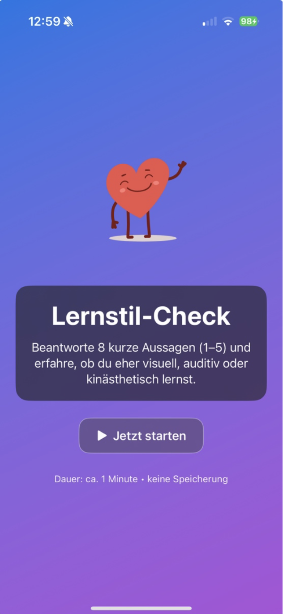
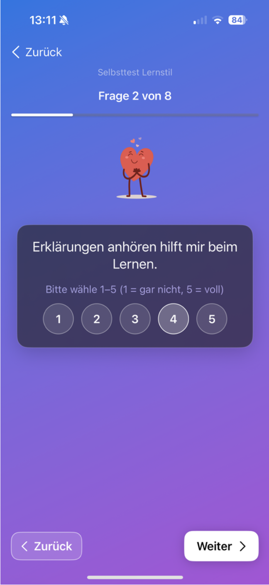
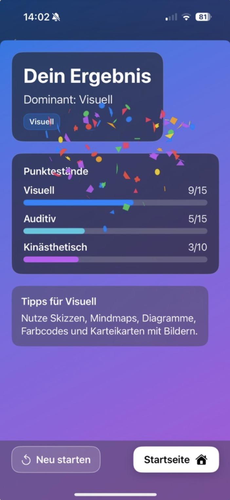
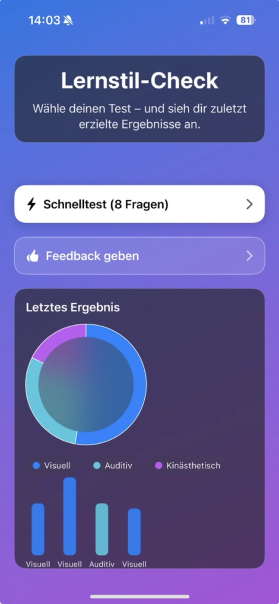

# LernstilCheck

LernstilCheck is an iOS application built with **Swift** and **SwiftUI** that allows users to quickly determine their dominant learning style through a short interactive self-assessment.

The app guides users through a short quiz and visualizes the results using charts and progress indicators. Based on the result, users receive simple learning tips tailored to their dominant learning style.

The goal of the project is to demonstrate modern **SwiftUI app architecture**, interactive UI design and basic data visualization in a clean and structured iOS application.

---

# Features

• Quick learning style self-test (8 questions)  
• Rating system (1–5 scale)  
• Result analysis (visual / auditory / kinesthetic)  
• Progress bars for score comparison  
• Result visualization with charts  
• Animated mascot elements  
• Feedback form for user input  
• Clean SwiftUI architecture  

---

# Tech Stack

Swift  
SwiftUI  
Supabase  
Lottie Animations  
iOS

---

# App Screenshots

### Start Screen


### Quiz Screen


### Result Screen


### Results Overview


---

# Project Structure

```
LernstilCheck
│
├── Components
│
├── Models
│ └── FeedbackRecord
│
├── Services
│ └── FeedbackService
│
├── Views
│ ├── HomeView
│ ├── IntroView
│ ├── QuizView
│ ├── ResultView
│ └── FeedbackView
│
├── Resources
│
├── AppState.swift
├── LernstilCheckApp.swift
└── Assets.xcassets
```

The project follows a simple modular structure:

Views  
User interface and navigation flow.

Models  
Data structures used in the application.

Services  
Logic and backend related functionality.

Components  
Reusable UI components.

Resources  
Static resources such as animations or configuration files.

---

# Learning Styles

The quiz evaluates three common learning style categories:

Visual  
Learning through diagrams, images, charts and visual structures.

Auditory  
Learning through listening, explanations and spoken information.

Kinesthetic  
Learning through physical activity, practice and hands-on interaction.

---

# Purpose of the Project

This project was created as part of a learning exercise to explore:

• SwiftUI based app architecture  
• interactive quiz based UI design  
• result visualization with charts  
• clean code organization in iOS projects  
• integration of animations and user feedback  

---

# Author

Andreas Warda
Software Engineering (B.Sc.)
IU International University

---

# License

This project was created for educational purposes.

